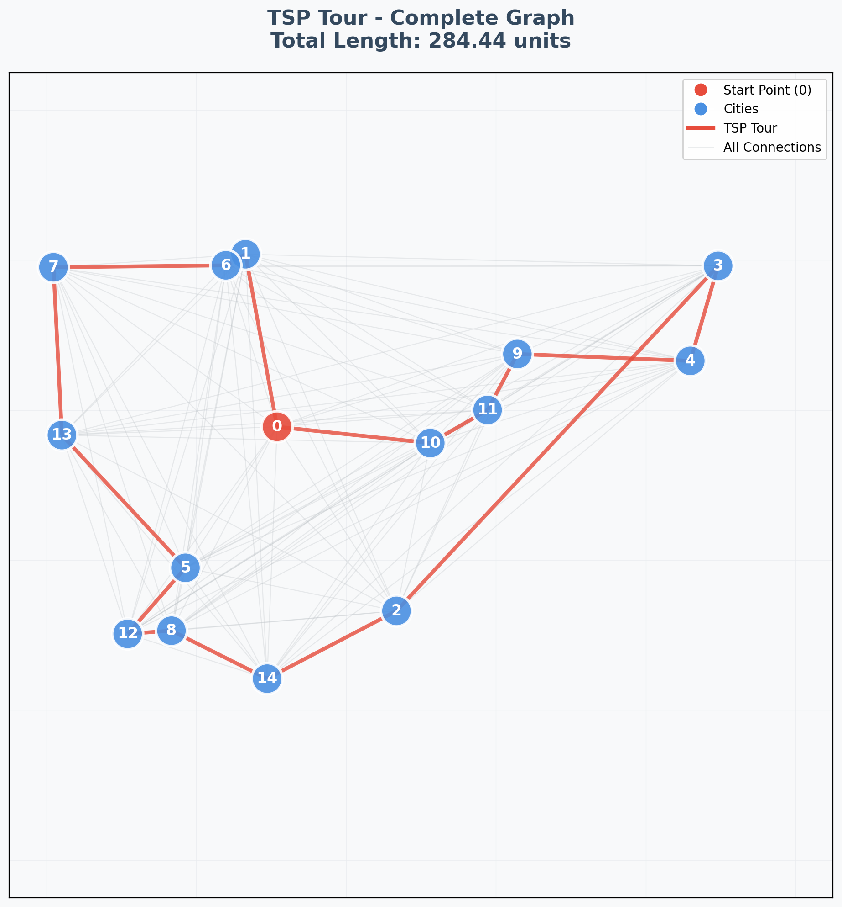

# Task 1: Random Points TSP

> Nearest Neighbor algorithm implementation for randomly generated TSP instances

---

## Overview

This task implements a basic TSP solver using the Nearest Neighbor heuristic on randomly generated points. The implementation uses NetworkX graphs without distance matrices for memory efficiency.

### Key Features

- **Graph-based approach** - Direct edge weight access without matrix storage
- **Complete graph generation** - All-to-all Euclidean distance connections
- **Nearest Neighbor heuristic** - Simple greedy TSP approximation
- **Visualization** - matplotlib plots

---

## Algorithm Details

### Nearest Neighbor Heuristic
1. Start at node 0
2. Repeatedly visit the closest unvisited node
3. Return to starting node to complete tour

**Time Complexity:** O(n²)  
**Space Complexity:** O(n²) for complete graph edges  
**Approximation Ratio:** No guaranteed bound (can be arbitrarily bad)

### Graph Structure
```python
# Complete graph with Euclidean distances
for i in range(n):
    for j in range(i+1, n):
        distance = sqrt((xi - xj)² + (yi - yj)²)
        G.add_edge(i, j, length=distance)
```

---

## Usage

### Basic Execution
```bash
python task1.py --n 15 --seed 42
```

### Parameters
| Parameter | Type | Default | Description |
|-----------|------|---------|-------------|
| `--n` | int | 15 | Number of random points |
| `--seed` | int | 42 | Random seed for reproducibility |
| `--out` | str | plot_task1.png | Output plot filename |

### Examples
```bash
# Small instance
python task1.py --n 10 --seed 100

# Large instance  
python task1.py --n 25 --seed 200 --out large_tsp.png

# Different random configuration
python task1.py --n 20 --seed 999
```

---

## Example Results

### Sample Output
```
Tour (indices): [0, 3, 7, 2, 8, 1, 5, 4, 6, 0]
Tour length ≈ 284.37 units
Saved plot: plot_task1.png
```
### Visual Output Example



*Example visualization showing:*
- **Gray edges**: All possible connections in complete graph
- **Red path**: Optimal TSP tour found by Nearest Neighbor
- **Red node**: Starting point (node 0)
- **Blue nodes**: Other cities in the tour
- **Grid background**: Coordinate reference system

## Dependencies

```txt
networkx>=3.0
matplotlib>=3.7.0
numpy>=1.24.0
```
[](https://classroom.github.com/a/hZgqM1Y0)

### Installation
```bash
pip install networkx matplotlib numpy
```

---
